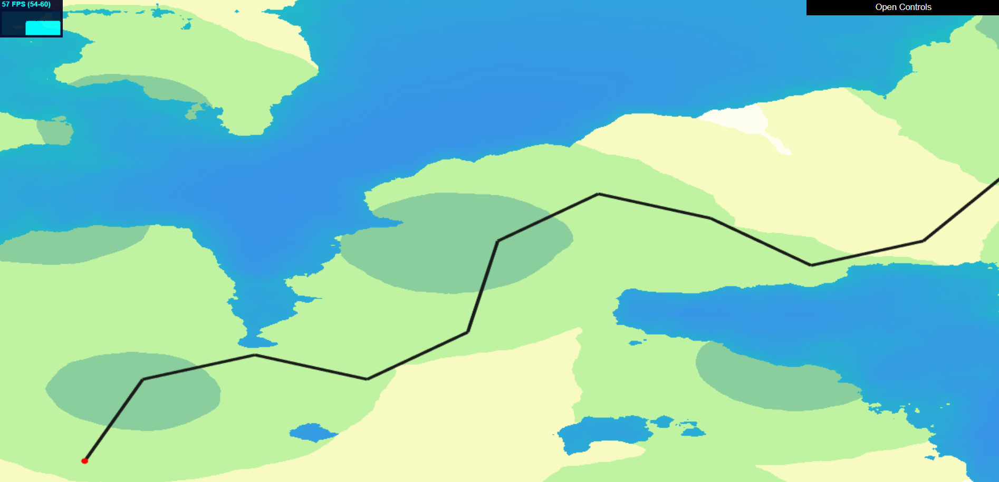
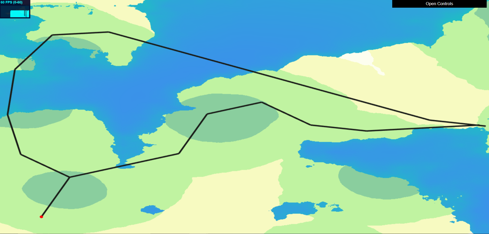
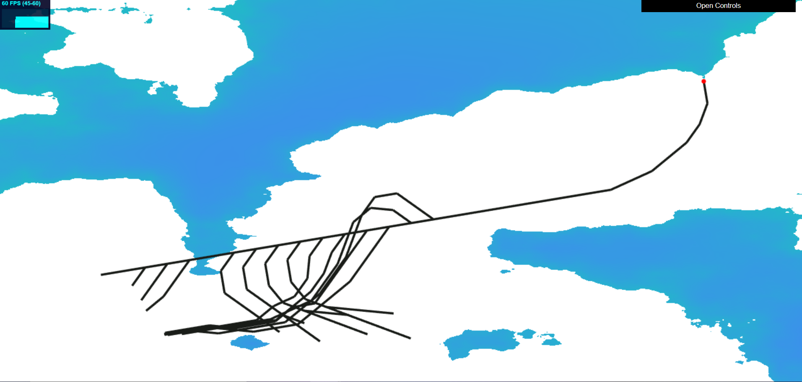
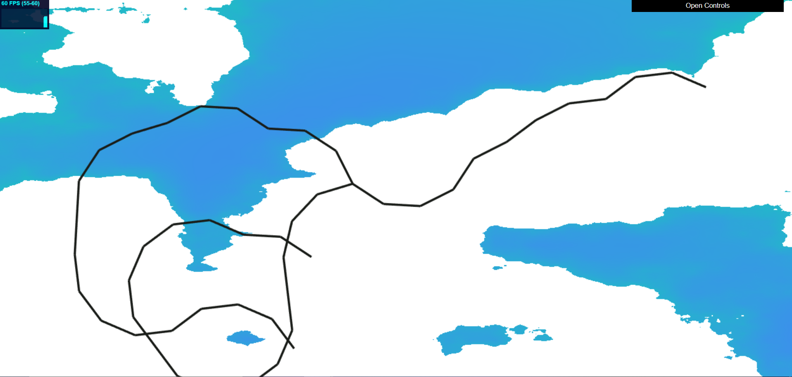
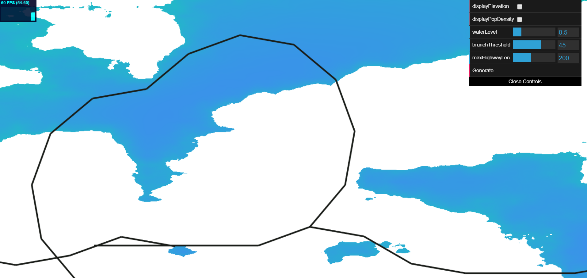
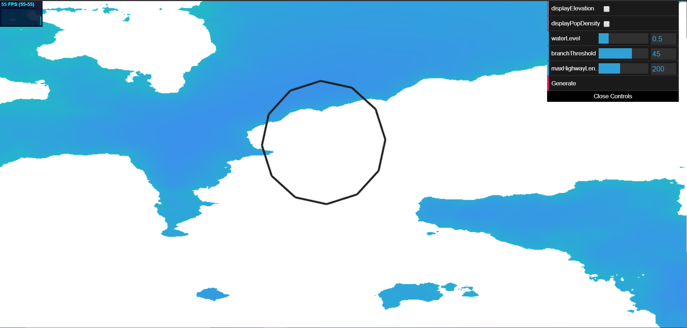

# Road Generation
**By Janine Liu / jliu99**

# External Resources

In addition to the class lectures and powerpoints, I consulted a few external resources for this project:
- https://stackoverflow.com/questions/41855261/calculate-the-angle-between-a-line-and-x-axis, for the formula for calculating the angle between a given line and the x-axis.
- https://stackoverflow.com/questions/563198/how-do-you-detect-where-two-line-segments-intersect, for a method of checking whether two line segments intersect or not.
- CIS460's HW5 assignment, for a general understanding of the frame / render buffer / texture pipeline.
- https://webglfundamentals.org/webgl/lessons/webgl-render-to-texture.html, for how to convert a rendered image into a texture in WebGL.
- https://www.khronos.org/registry/OpenGL-Refpages/gl4/html/glReadPixels.xhtml, for how to get the pixels from a texture.

# Live GitHub demo
https://j9liu.github.io/roadgen/

# Data Generation and Aesthetic Features

The height map used is generated from an FBM noise function and looks as follows with a strictly land-water view. 

For the more detailed elevation map, the heights were hardcoded to a color map where the lighter the color, the higher the height.

The population density is generated from a combination of FBM noise and Worley noise, and was also manually color mapped as shown.

It is possible to display both the elevation data and the population data at the same time, overlaid on top of one another.

# Road Representation

The tweakable, self-sensitive nature of the road network demands that roads be stored as mutatable data before being committed to visual objects. Here, roads are represented as instances of the `Edge` class, where an `Edge` is defined by two 2D points. An `Edge` can perform various calculations on itself, such as calculating its length and midpoint, and checking for its intersections with other `Edge`s.

Intersections between two or more `Edge`s are marked by a `Node`. `Node`s do not necessarily mark the endpoints of each edge; they function as markers for intersections between edges. This way, an intersection of two `Edge` instances won't require the edges to be broken into multiple `Edge`s that share an intersection, creating duplicate data.

# Road Generator Set-Up

The road data is generated by an instance of the `RoadGenerator` class For this class to generate roads, it first defines the two-dimensional space in which the data exists called "cityspace." The bounds of cityspace are defined from (0, 0) in the bottom left corner to a specified (width, height) in the upper right corner. Our generator operates within the coordinates of this cityspace to produce roads and intersections (as represented by `Edges` and `Nodes`); their positions will then be transformed from cityspace to the space on the actual screen.

The generator also operates on a grid-cell system for storing relevant information about the `Node`s' whereabouts. There are two arrays that track `Node`s and `Edge`s respectively: `Node`s are stored based on what cell they fall into, while `Edge`s are stored in the cells they intersect. The `Edge`s are also stored in a separate array so they can be more easily exported for rendering. This system is used to reduce the amount of time it takes to check if a road intersects another road, since only the cells covered by an `Edge` or containing a `Node` need to be checked.

The grid system is illustrated below:

Cells are numbered according to their index in the arrays. Calculating the cell in which a point lies, or the cells that a line intersects, just requires arithmetic. Thus, storing and retrieving data takes constant time compared to an unorganized list, which would need to be iterated through completely.

# Pseudo L-System Constraints

I adapted the L-System framework from my [previous project](https://j9liu.github.io/plant/) as a basis for the road generator. There are no strings and expansion rules involved, but the generator uses a stack of `Turtle` agents to help draw the roads on the screen. Instead of relying on an axiom, these `Turtle`s determine whether or not to continue expanding (and in what directions) based on fixed conditions and goals for each road type.

**Highways**

The expansion procedure for highways mirrors the implementation in the [Procedural Modeling of Cities](proceduralCityGeneration.pdf) handout. Highways rely on the population density map for expansion. When a highway expands from the current drawing `Turtle`'s position, multiple `Turtle` instances are marched along rays in a search radius, where each ray tests a new direction for potential expansion. Each ray is assigned a weight, where the weight is the sum of samples of the population function along the ray divided by the samples' distance from the original point. Then, the direction with the largest weight is chosen for the current `Turtle` to draw along.

The generator will also try to branch the highways if there are two points of compelling population density that are far enough apart. As the `Turtle` instances are marched along the search rays, the generator will look for additional data besides the maximum-weighted direction. First, the `Turtle` marching the original direction will sample a bit farther beyond the other `Turtle`s. Second, the generator will also track a second maximum-weighted direction. If the `Turtle`'s rotates far enough from its original direction (past a certain threshold), the generator will use the extended weight sample of the original direction to determine if it is worth to spawn a new `Turtle`. It compares the differences between the three weights: if the extended weight is closer to the maximum weight than it is to the second maximum weight, then the generator will decide to branch. Otherwise, it will try to branch a second way, looking at the angle between the search rays corresponding to the two max weights. If this angle also surpasses the threshold, then the generator will spawn another `Turtle` facing that direction so that both roads can grow away from each other.

This method won't guarantee that the roads don't spawn multiple branches leading to population hotspots. If the `Turtle` draws in small increments, it may spawn multiple branches towards the same population peak; an example of this undesired behavior is shown below. Thus, the length that a `Turtle` travels at a time is large. The `Turtle` tries to compensate for the lost detail as it actually renders the highway, explained in a later section.

A problem that arose during the highway generation is this curling behavior, showcased in these next few images. 

This happened when a `Turtle` was on the periphery of a population hotspot; it will skirt around the edges, forming these circle patterns that aren't desired. To counter this, the `Turtle`s will now keep track of how much they have rotated from when they spawned; if the `Turtle`'s desired rotation will make it surpass 180 degrees, it will not rotate.

**Street Grids**

The generator is always looking for grids to be spawned from the highways for maximum road coverage. Once a highway has been committed to the network, a series of smaller streets can be spawned from it to form grid-based neighborhoods. 

To determine how the grids grow from a highway, first the generator determines what angle the grid system should follow. The generator has a global direction to determine where these roads 

case 1: angle between perpendicular and global direction is close, choose global dir
case 2: angle between road direction and global direction is close. choose perpendicular to global dir
case 3: local perpendicular

The `Turtle` depth value 

**General Constraints**

- **City Bounds**:

- **Water Level**: It is illegal for any road to end in a body of water, so the network must check if such edges exist. If a newly created edge ends in the water, the generator tries to extend the road to a nearby shore if it's a highway, or shorten the road to end on land. If the highway cannot be successfully stretched, or the resulting edge is too short, it is disregarded.

- **Self-Sensitivity**: Given a new edge, the network determines the closest intersection to the end of the edge; if it falls close enough to the edge (as defined by a chosen radius), the edge snaps to that intersection. The network then generates all intersections this new edge has with other edges in the network, provided they don't already exist. Finally, the closest new intersection is also managed so that if it occurs within a similar threshold, the end of the edge snaps to that new intersection.

# Road Visualization

Roads are visualized simply with a flat rectangle that gets projected directly to the screen. The road generator creates its own projection matrix to transform the network cityspace coordinates (from (0, 0) and (width, height)) to screen coordinates (from (-1, -1) and (1, 1)), such that they can be displayed in a 2D view as shown. Highways are thicker and darker in color, while smaller roads are thinner and lighter.   // Main roads are highways while small roads are streets.
  // They are separated so that they can be rendered with different colors and sizes