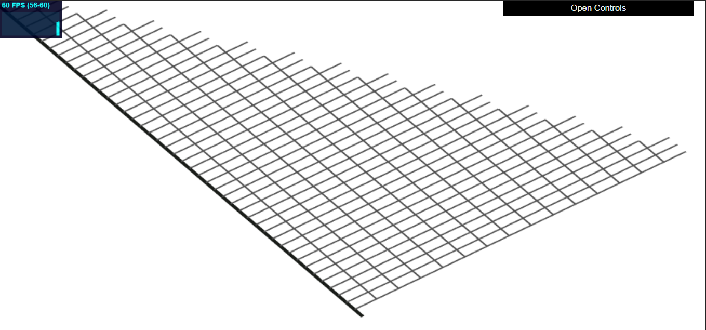
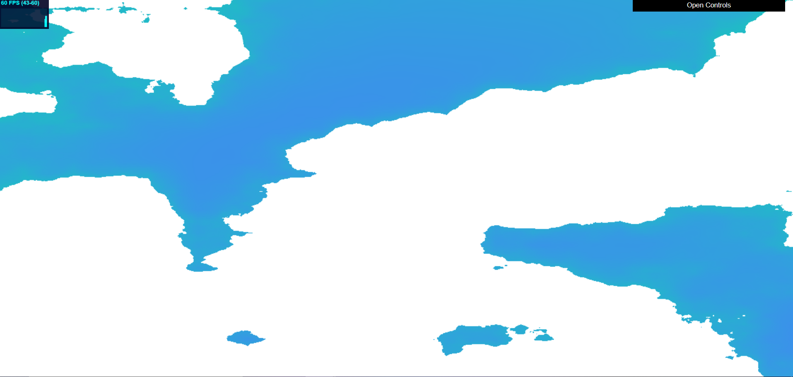
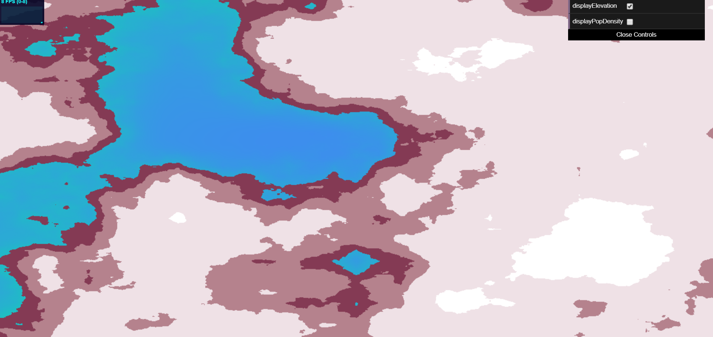
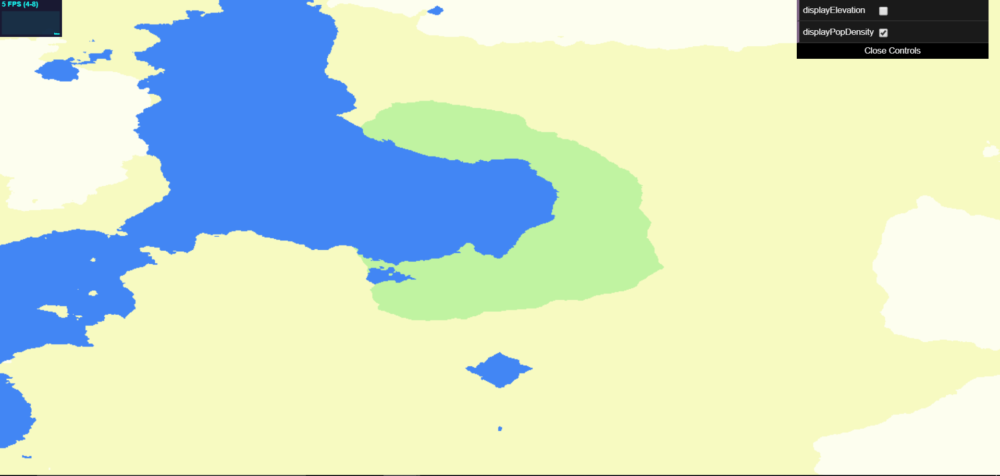
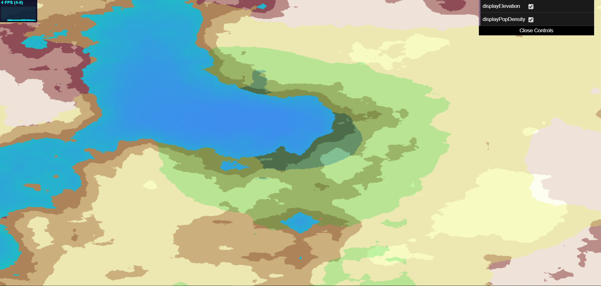

# Road Generation
**By Janine Liu / jliu99**

# External Resources

In addition to the class lectures and powerpoints, I consulted a few external resources for this project:
- https://stackoverflow.com/questions/41855261/calculate-the-angle-between-a-line-and-x-axis, for the formula for calculating the angle between a given line and the x-axis.
- https://stackoverflow.com/questions/4977491/determining-if-two-line-segments-intersect/4977569, for a method of checking whether two line segments intersect or not.

# Live GitHub demo
https://j9liu.github.io/roadgen/

# Known Issues

For some reason the elevation and population functions generated on the CPU are not equivalent to the ones generated on the GPU. Unfortunately I ran out of time to tweak this, so I can only acknowledge the bug.

# Network Representation

Due to the tweakable, self-sensitive nature of the network, the roads needed to be stored as mutatable data before they were committed to visuals. Therefore, the roads are represented as instances of an Edge class, and intersections between two or more edges are marked by a Node class. While a Node is merely a marker for an intersection, an Edge can interact more with its surroundings, such as checking for intersections with other edges.

# Cityspace Set-Up

We define the space in which the roads are initially created as "cityspace." The bounds of cityspace are defined from (0, 0) in the bottom left corner to a specified (width, height) in the upper right corner. Our road generator operates within the coordinates of this cityspace to produce roads, then uses its own projection matrix to transform the network cityspace coordinates (from (0, 0) and (width, height)) to screen coordinates (from (-1, -1) and (1, 1)), such that they can be displayed in the 2D view as shown.

In order to reduce the amount of time it takes to check if a road intersects another road, we sort the edges in the .

# L-System Ruleset

I took my L-System framework from my [previous project](https://j9liu.github.io/hw4/) as a basis for the behavior of the road generator. While there were no strings and expansion rules involved, I used my implementation of the DrawingRule class to clarify probabilistic behaviors for the Turtle that draws the roads. To pick an outcome, I would generate a random number, then sum the probability of the rules until it was equal to or greater than the random number. Due to the use of the Math.random() function, the seed is not consistent and changes when generating a new road network.

**Basic Road Branching Rules**
- (50% probability) Draw a highway within a range in front of the Turtle.

- (30% probability) Return to a previous highway end and draw a highway that branches away from the path.

- (10% probability) Rotate an angle counter-clockwise (can be changed by viewer).

- (10% probability) Rotate an angle degrees clockwise (can be changed by viewer).

**Grid Road Drawing Rules**
- (50% probability) Draw a grid that terminates early.

# Drawing Constraints

There are three ways in which the road network uses checks as it generates new streets:

- **City Bounds**: Given a new edge, the network checks if the edge goes too far off screen and, if so, adjusts the endpoint's position to be within a more acceptable range. If the resulting edge is too short, it is disregarded.

- **Water Level**: Given a new edge, the network checks if an edge terminates in the water and, if so, tries to either extend the road to an island (if it's a highway) or shorten the road to end on land If the resulting edge is too short, it is disregarded.

- **Self-Sensitivity**: Given a new edge, the network determines the closest intersection to the end of the edge; if it falls close enough to the edge (as defined by a chosen radius), the edge snaps to that intersection. The network then generates all intersections this new edge has with other edges in the network, provided they don't already exist. Finally, the closest new intersection is also managed so that if it occurs within a similar threshold, the end of the edge snaps to that new intersection.

# Aesthetic Features

The height map used is generated from an FBM noise function and looks as follows with a strictly land-water view. 

For the more detailed elevation map, the heights were hardcoded to a color map where the lighter the color, the higher the height.

The population density is generated from a combination of FBM noise and Worley noise, and was also manually color mapped as shown.

It is possible to display both the elevation data and the population data at the same time.

