# Road Generation
**By Janine Liu / jliu99**

# Live GitHub demo
https://j9liu.github.io/roadgen/

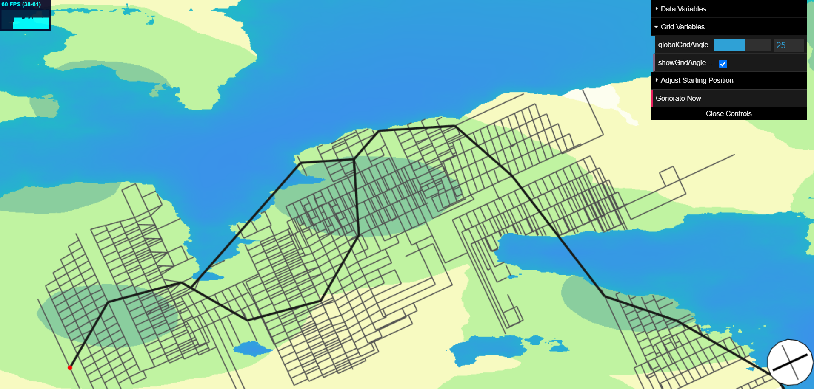

## Data Generation

The height map used is generated from an FBM noise function and looks as follows with a strictly land-water view. 

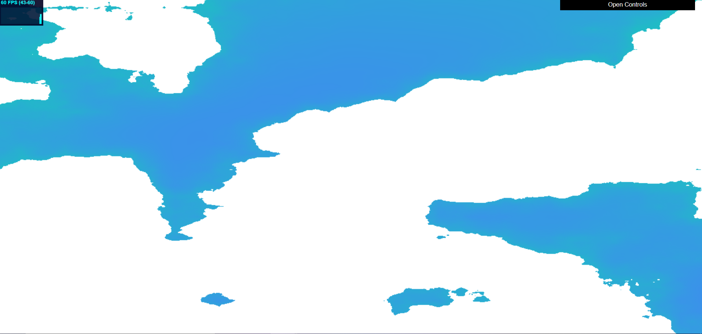

In the detailed elevation map, several height ranges were hardcoded to a color map to make them more readable. The lighter the color, the higher the height.

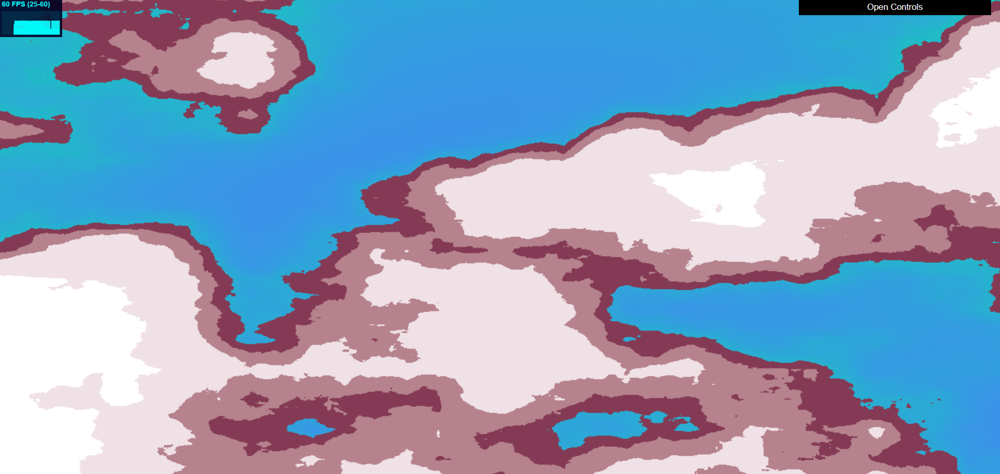

The population density is generated from a combination of FBM noise and Worley noise, where the points generated in the Worley cells mark the peaks in population. This map was also manually color-mapped as shown.

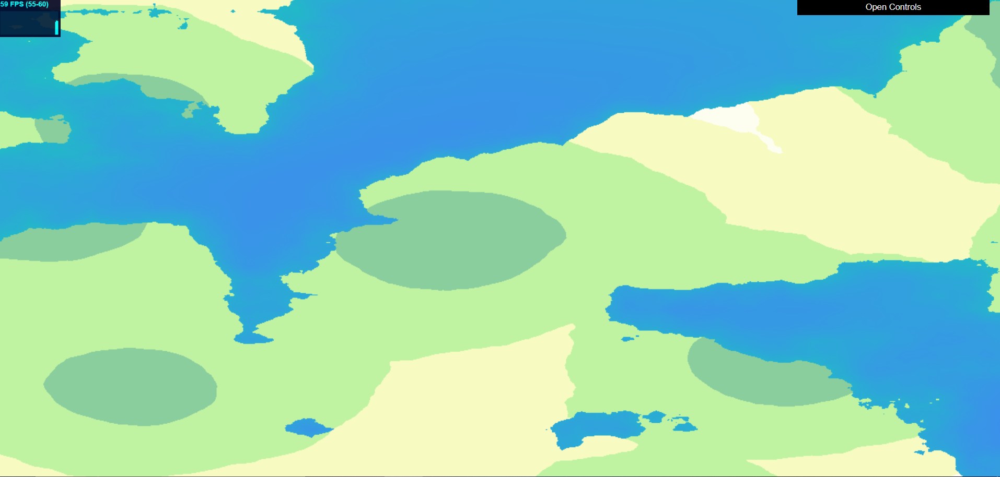

Both data maps can display at the same time, overlaid on each other.

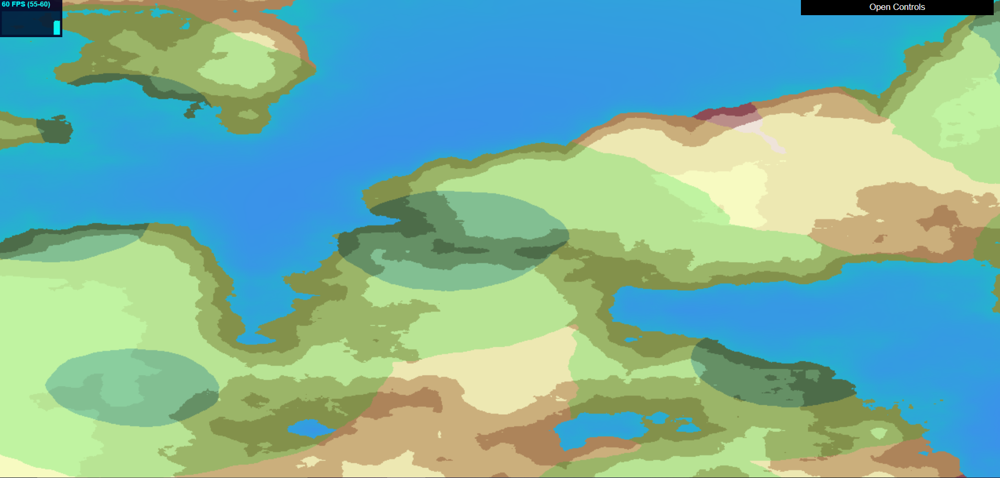

These functions were developed in the GLSL shaders first. When I attempted to convert the functions into Typescript for the RoadGenerator, however, the same input would result in different values for the functions used. To circumvent this error, I relied on RGB values in a texture to store the height and population data. At the start of the program, I use the raw data shader (without the aesthetic color maps) to render the data on the background, pass it to a frame buffer, and then write it to a texture. Then, the generator can parse the height and population data from the RGB values of each pixel.

## Road Representation

The tweakable, self-sensitive nature of the road network demands that roads be stored as mutatable data before being committed to visual objects. Here, roads are represented as instances of the `Edge` class, where an `Edge` is defined by two 2D points. An `Edge` can perform various calculations on itself, such as calculating its length and midpoint, and checking for its intersections with other `Edge`s.

Intersections between two or more `Edge`s are marked by a `Node`. Currently `Node`s do not necessarily mark the endpoints of each edge; they function as markers for intersections between edges. This system was initially conceived to circumvent breaking large edges into smaller ones when the grid roads were being developed. It also intended to prevent the creation of duplicate nodes occupying the same intersection. However, this does make long roads less adjustable after they are committed to the network.

## Road Generator Set-Up

The `RoadGenerator` takes the given height and population data to generate the road network. For this class to generate roads, it first defines the two-dimensional space in which the data exists called "cityspace." The bounds of cityspace are defined from (0, 0) in the bottom left corner to a specified (width, height) in the upper right corner. Our generator operates within the coordinates of this cityspace to produce roads and intersections (as represented by `Edges` and `Nodes`); their positions will then be transformed from cityspace to the space on the actual screen.

The generator also operates on a grid-cell system for storing relevant information about the `Node`s' whereabouts. There are two arrays that track `Node`s and `Edge`s respectively: `Node`s are stored based on what cell they fall into, while `Edge`s are stored in the cells they intersect. The `Edge`s are also stored in a separate array so they can be more easily exported for rendering. This system is used to reduce the amount of time it takes to check if a road intersects another road, since only the cells covered by an `Edge` or containing a `Node` need to be checked.

The grid system is illustrated below:

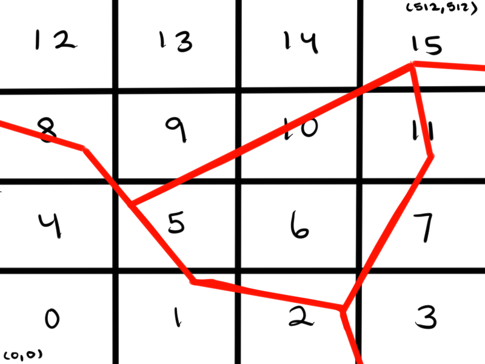

Cells are numbered according to their index in the arrays. Calculating the cell in which a `Node` lies, or the cells that an `Edge` intersects, only requires arithmetic. Thus, storing and retrieving data takes constant time compared to an unorganized list of components, which would need to be iterated through completely.

## Pseudo L-System Constraints

I adapted the L-System framework from my [previous project](https://j9liu.github.io/plant/) as a basis for the road generator. There are no strings and expansion rules involved, but the generator uses a stack of `Turtle` agents to draw the roads on the screen. Rather than relying on a string axiom, these `Turtle`s use fixed conditions and goals for the type of road they are currently drawing to determine whether or not continue expanding, and in what directions.

**Highways**

The expansion procedure for highways mirrors the implementation in the [Procedural Modeling of Cities](proceduralCityGeneration.pdf) handout. Highways rely on the population density map for expansion. When a highway expands from the current `Turtle`'s position, multiple `Turtle` instances are marched along rays in a search radius, and each ray tests a new direction for expansion. These rays sample the population function at multiple points and divide each value by the sample's distance from the original point. Then, the weight of each ray equals the sum of these weighted samples. The maximum weighted ray is then chosen as the direction for the current `Turtle` to expand towards.

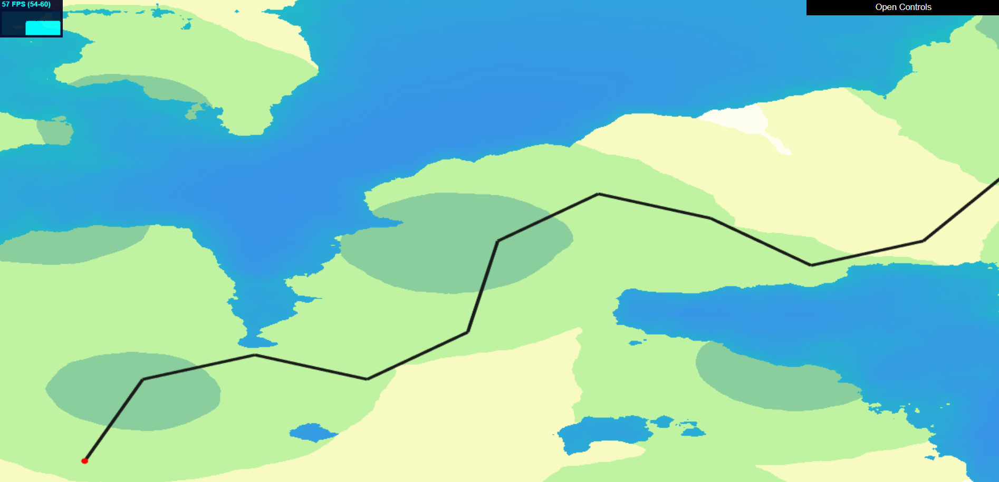

The generator will also try to branch the highways if there are two points of compelling population density that are far enough apart. As the `Turtle` instances are marched along the search rays, the generator will look for additional data besides the maximum-weighted direction. First, the `Turtle` marching the original direction will sample a bit farther beyond the other `Turtle`s. Second, the generator will also track a second maximum-weighted direction. If the `Turtle`'s rotates far enough from its original direction (past a certain threshold), the generator will use the extended weight sample of the original direction to determine if it is worth to spawn a new `Turtle`. It compares the differences between the three weights: if the extended weight is closer to the maximum weight than it is to the second maximum weight, then the generator will decide to branch. Otherwise, it will try to branch a second way, looking at the angle between the search rays corresponding to the two max weights. If this angle also surpasses the threshold, then the generator will spawn another `Turtle` facing that direction so that both roads can grow away from each other.

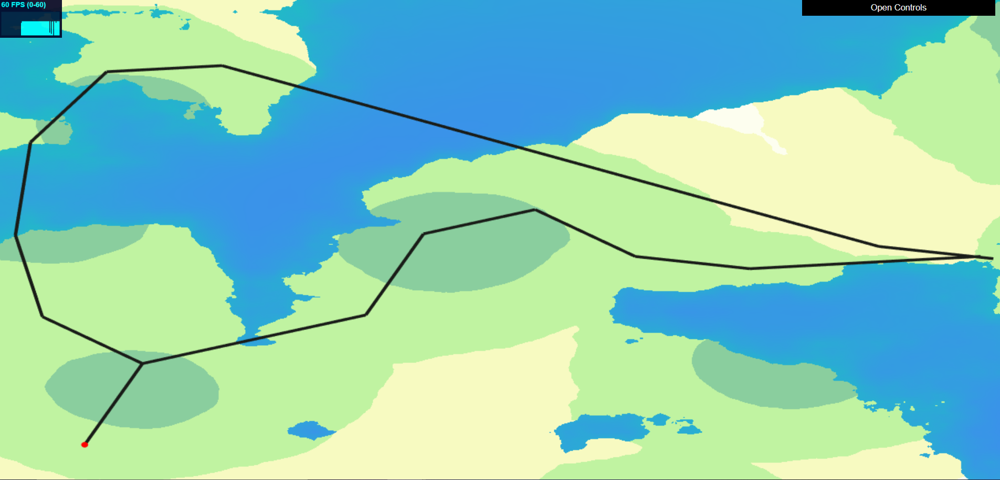

These weight checks were implemented to discourage frequent branching; an example of this undesired behavior observed is shown below. As an additional safeguard, the length that a `Turtle` travels at a time is large.

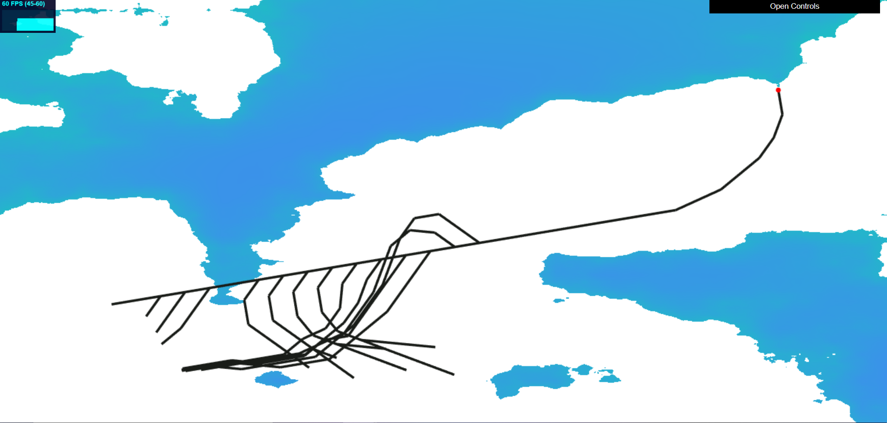

A problem that arose during the highway generation is this curling behavior, showcased in these next few images. 

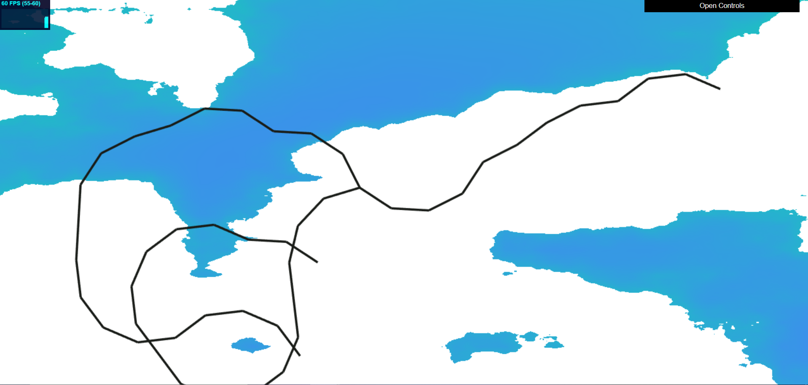
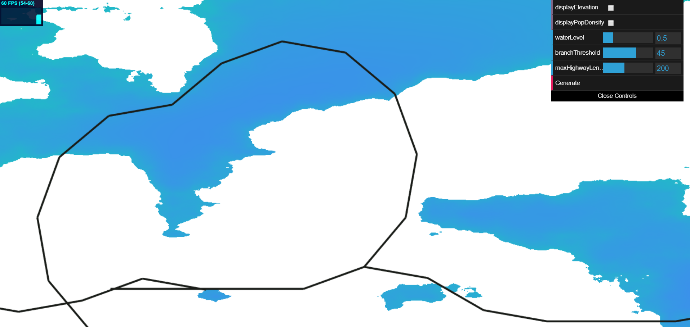
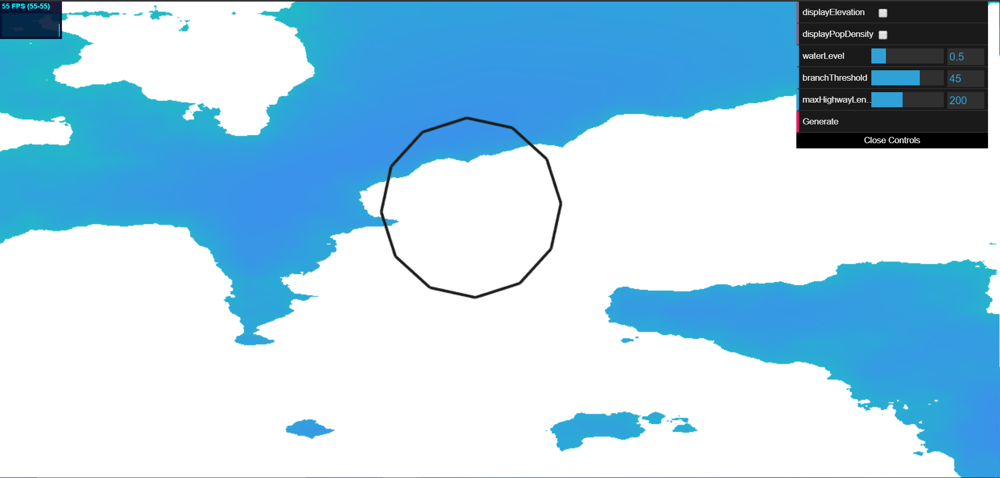

This happened when a `Turtle` was on the periphery of a population hotspot; it will skirt around the edges, forming these circle patterns that aren't desired. To counter this, the `Turtle`s will now keep track of how much they have rotated from when they spawned; if the `Turtle`'s desired rotation will make it surpass 180 degrees, it will not rotate.

**Street Grids**

Once all highways have been drawn, the generator prepares to draw smaller streets spanning from and between the highways. These streets are meant to form a grid pattern similar to blocks in a populated city. Following the behavior described in the [Procedural Modeling of Cities](proceduralCityGeneration.pdf) handout, the roads adhere as much as possible to a global angle specified by the generator, only branching along the local perpendicular if the global direction results in grids too close to the street.

Initially, I attempted to draw one block at a time, with `Turtle`s drawing one perpendicular road and one parallel road in a single iteration. When this corner-shaped pattern was drawn multiple times, the lines would ultimately form a grid. However, when road sensitivity was implemented, this resulted in a lot of short hook-like streets, since one road would be fully drawn but the other would be truncated. This process comes in two parts: first, `Turtle`s are spawned in increments along every highway to branch out into blocks. These `Turtle`s march away from the highway as far as possible, ending when either the maximum number of iterations has been achieved, or when they intersect with the other roads. After these foundations are laid, `Turtle`s are marched along these streets in a similar manner, branching out from one side of the road to avoid clutter.

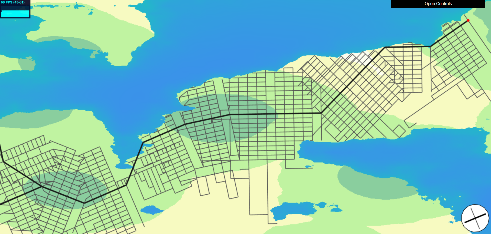

This is a result of the implementation with additional adjustments to make the roads appear presentable, which are discussed below.

**Road Sensitivity**

If roads are drawn by the generator without any awareness of nearby streets, the streets will clutter and intersect undesirably.

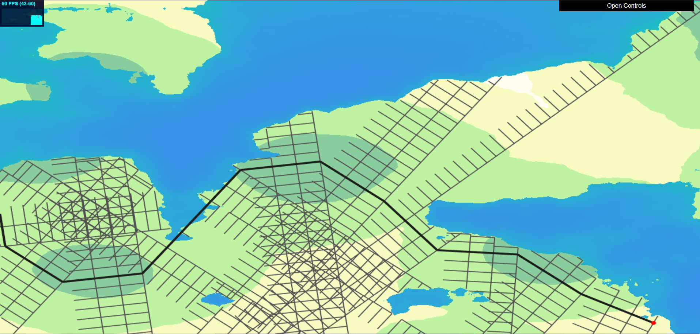

 Therefore, prior to a road's commitment to the network, the generator will perform the following checks:

 1. **Mid-Edge Intersection**

 Given a new edge, the generator will iterate through all nearby edges to determine if any intersect this one. This step uses the grid system established at the start of road generation. If an intersection is found between the two endpoints of the street, the road will be truncated to that point, and a new `Node` will mark that intersection.

 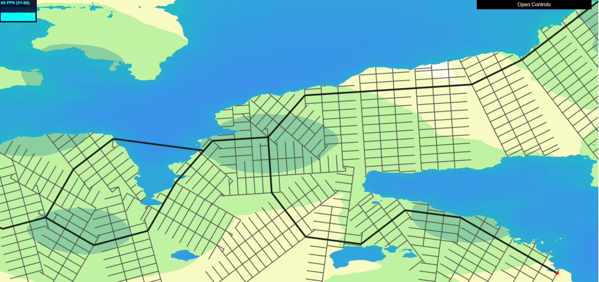

 2. **Endpoint Distance from Nearby Nodes**

Next, the generator searches for the intersection closest to the end of the edge. If the distance from the edge's endpoint to the intersection is shorter than a set threshold, the endpoint will snap to that intersection. This is demonstrated in the very first image of the grid road networks.

 3. **Extension**

Finally, if the edge hasn't already found an intersection from the two earlier tests, the generator will extend the road a certain distance and see if it can either intersect with another road, or find a nearby intersection to snap to. If a valid intersection is found, this new endpoint will be committed to the network. Otherwise, the generator won't bother keeping the extension.

**Randomness**

As of the date I last worked on this, I have not implemented any checks to stop the grid roads from expanding infinitely. They will keep drawing until the maximum number of iterations is reached. This means that some undesirably long roads can result, as shown.

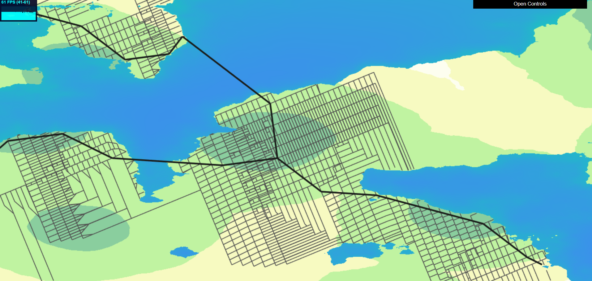

As a quick fix, and to add some variety and unpredictability to the generated roads, I added the option to include randomness in the grid expansion. When the `Turtle` is expanding parallel to the highway (perpendicular to the foundations of the grid), there's a probability that it will turn 90 degrees counter-clockwise, causing the street to wrap around a corner instead of expanding into the distance. This helps to contain new streets to the general city area and prevent them from going too far off-screen.

Additionally, while the generator is laying down the foundations of the grid, there is a possibility that it will spawn a `Turtle` facing the opposite side of the road. `Turtle`s only expand from one side of these roads because of an issue with `Node` equality; road intersections cannot be perfectly on top of each other, so the threshold for considering two `Node`s equal has to be a bit high. However, the sensitivity of this equality is hard to balance--too high of a sensitivity makes the grid `Nodes` fuse together, ruining the grid structure, while too low of a sensitivity prevents most streets from finding nearby intersections. This especially causes problems with roads that are practically on top of each other, but not considered close enough based on the specified threshold for `Node` equality. If the city's streets send `Turtle`s on either side of the roads, the `Turtle`s will not reliably sense that they are drawing the same street, so two very close streets will be drawn, and they won't be perfectly aligned. Unfortunately, expanding along only one side of the street can leave strange gaps between each individual highway's grid, because no `Turtle`s are sent from the other side to find other grids. To compensate for this imperfection, during the creation of the first set of grid streets, the `Turtle`s have a possibility to branch a duplicate `Turtle` pointing towards the other side. Although this may still result in unaligned streets, the random aspect makes it occur less often, so the result on average is still pleasing.

This road map has the same starting position and variables as the one above, but randomness allows it to be less linear and more varied in its generation.

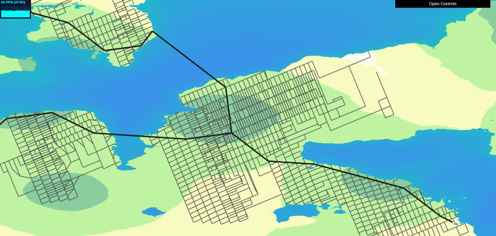

## General Constraints

- **City Bounds**: If a road extends beyond the bounds of the city, the network will stop attempting to expand from that road's endpoint.

- **Water Level**: It is illegal for any road to end in a body of water, so the network must check if such edges exist. If a newly created highway ends in the water, the generator will try to extend the road to the shore in the road's direction. If it cannot be stretched, or if the road is a regular street, the generator will try to shorten the road so its endpoint is on land. If the resulting edge is too short, it is disregarded.

## Road Visualization

Roads are visualized simply with a flat rectangle that gets projected directly to the screen. The road generator creates its own projection matrix to transform the network cityspace coordinates (from (0, 0) and (width, height)) to screen coordinates (from (-1, -1) and (1, 1)), such that they can be displayed in a 2D view as shown. Highways are thicker and darker in color, while smaller roads are thinner and lighter.

## Interactive Parameters

Viewers can adjust some of the parameters for the road generator to see how they impact the resulting network. The user can decide whether to generate a random starting position for the first `Turtle`, or to specify their own. They also can adjust the water level of the height map, but increasing this will cause some population peaks to disappear underwater.

Regarding grid-related parameters, the viewer can decide whether or not to use randomness to generate roads, as described above. They can also adjust the maximum number of iterations that the generator will take to draw these streets. The following two road maps were generated with the same starting position and other parameters; the first uses five iterations while the second uses twenty five.

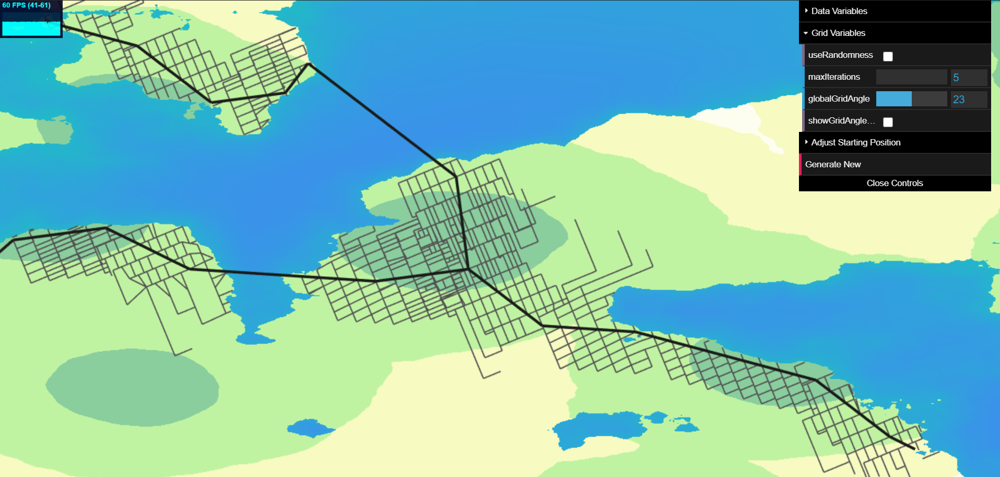

The viewer can also adjust the global angle used to align the grids. They can turn on a visualizer that shows up in the bottom right corner and demonstrates how the grid will look at a certain angle. Below are two maps with the same parameters, but different global gridangles.

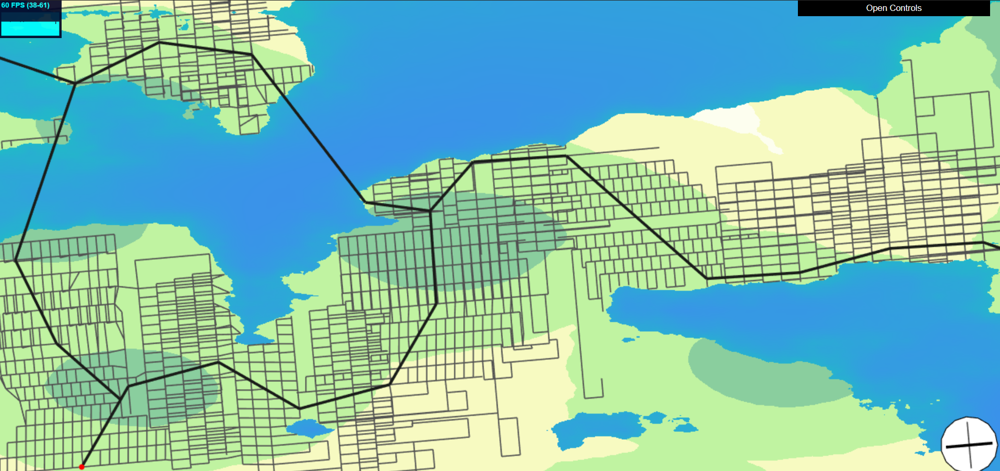

## Future Improvements
- Highways are drawn in a strictly linear fashion, and in large increments. Breaking these highways into smaller edges that curve along their path would result in more interesting formations.
- Currently, grids expand from the highways regardless of population data. It would be more realistic if the generator used population density to determine the boundaries of the grids, as well as the density of each neighborhood.
- While the randomness provides an interesting unpredictability to the resulting roads, it was mainly included to circumvent issues with road sensitivity and infinite expansion. These problems should be addressed in a way that results in a deterministic output, so that the same road network can be generated with the same parameters, while also looknig just as good as the slightly random output
- All of the grid roads are rendered with the same thickness and color, making the blocks appear regular and monotone. Some of these roads could be drawn thicker to appear more like "main" streets, which will make the others look like side streets for a more interesting output.
- Roads will stop themselves from expanding into water, but they encroach to close to the shore to feel realistic. They could rely more on the height map to determine where they should stop before they are too deep into the coasts.
- Only one set of data is supplied to the generator, so it would be good to test the generator on other sets of height and population data that the viewer could toggle between.

## External Resources

In addition to the class lectures and powerpoints, I consulted a few external resources for this project:
- https://stackoverflow.com/questions/41855261/calculate-the-angle-between-a-line-and-x-axis, for the formula for calculating the angle between a given line and the x-axis.
- https://stackoverflow.com/questions/563198/how-do-you-detect-where-two-line-segments-intersect, for a method of checking whether two line segments intersect or not.
- CIS460's HW5 assignment, for a general understanding of the frame / render buffer / texture pipeline.
- https://webglfundamentals.org/webgl/lessons/webgl-render-to-texture.html, for how to convert a rendered image into a texture in WebGL.
- https://www.khronos.org/registry/OpenGL-Refpages/gl4/html/glReadPixels.xhtml, for how to get the pixels from a texture.